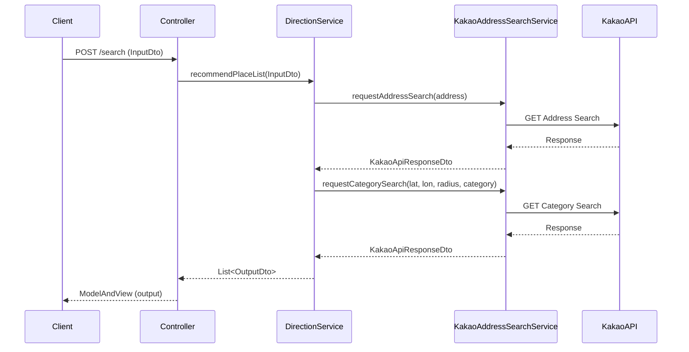
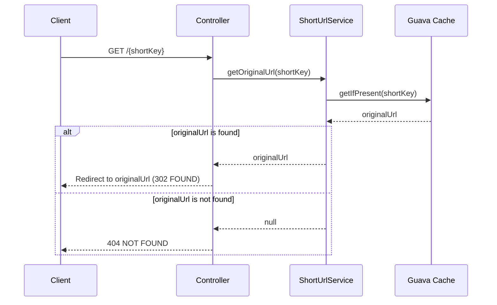
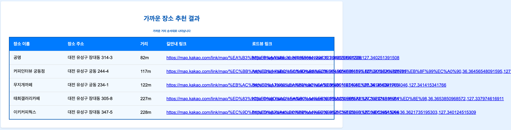
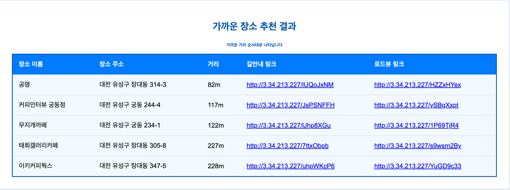

# 🚏가까운 곳!
사용자가 카테고리와 주소를 입력하면 반경 10km 내 장소 5곳을 가까운 순서대로 추천해주는 서비스입니다.

카카오 api를 활용한 프로젝트로 찾을 수 있는 장소 카테고리는 아래와 같습니다.

- 대형마트, 편의점, 주차장, 주유소/충전소, 지하철역, 은행, 문화시설, 중개업소, 공공기관, 관광명소, 숙박, 음식점, 카페, 병원, 약국

# 결과물
* [가까운 곳! 서비스 체험해보기](http://nearbyplace.ap-northeast-2.elasticbeanstalk.com/)


# 어플리케이션 아키텍처


## 개발 환경

- `intellij`
- `Gradle`
- `Java 17`
- `git/github`

## 기술 스택

- `spring boot`
- `thymeleaf`
- `github action`
- `kakao api`
- `AWS` - `EC2`

# 시퀀스 다이어그램


- 장소 추천



- 짧은 url 리다이렉팅


# 개발 당시 고민 사항
## 1. 데이터베이스를 사용할 것인가
이 프로젝트는 카카오 API를 활용하여 카카오 서버로부터 데이터를 가져옵니다.

데이터베이스에 이러한 데이터를 저장하는 것은 저작권 문제를 야기할 수 있으며, 데이터베이스 운영 비용도 증가시킵니다.

이러한 점들을 고려하여, 저는 비용 효율성과 법적 리스크를 최소화하기 위해 이 프로젝트에서 데이터베이스를 사용하지 않기로 결정했습니다.

## 2. 너무 긴 url을 어떻게 줄일 것인가
### Before


### After


장소 추천 결과로 제공되는 길안내 및 로드뷰 링크의 길이가 지나치게 길어 UI에서 지저분하게 보이는 문제가 있었습니다.

프론트엔드에서 URL을 부분적으로 표시하는 방법도 있었지만, 백엔드에서 URL을 단축하는 보다 근본적인 해결책을 모색했습니다.

```java
@Service
public class ShortUrlService {
    private final ConcurrentHashMap<String, String> urlMap = new ConcurrentHashMap<>();
    private final String BASE_URL = "http://localhost:8080/";

    public String shortenUrl(String originalUrl) {
        String shortKey = generateRandomKey(8);  // 8자리 랜덤 키 생성
        while (urlMap.containsKey(shortKey)) {
            shortKey = generateRandomKey(8);  // 중복되는 키가 있을 경우 재생성
        }
        urlMap.put(shortKey, originalUrl);
        return BASE_URL + shortKey;
    }

    public String getOriginalUrl(String shortKey) {
        return urlMap.get(shortKey);
    }

    private String generateRandomKey(int length) {
        return ThreadLocalRandom.current().ints(48, 122)
                .filter(i -> (i <= 57 || i >= 65) && (i <= 90 || i >= 97))
                .limit(length)
                .collect(StringBuilder::new, StringBuilder::appendCodePoint, StringBuilder::append)
                .toString();
    }
}
```

이를 위해 랜덤 알파벳을 사용해 8자리 키값을 생성하고, 이를 BASE_URL에 추가하여 짧은 URL을 생성하는 서비스를 개발했습니다.

이 과정에서 키-값 저장소로 레디스의 도입을 고려했으나, 현재 애플리케이션의 사용자 수와 성능 이슈를 감안할 때, 불필요한 초기 비용 증가를 피하기 위해 ConcurrentHashMap을 사용하기로 결정했습니다.


여기서 문제가 발생합니다. 어플리케이션을 재시작하지 않는 이상 ConcurrentHashMap에 계속 데이터가 쌓일 것이고 이는 성능에 영향을 끼치기 때문에 개선이 필요했습니다.
```java
private final Cache<String, String> cache = CacheBuilder.newBuilder()
        .maximumSize(10000)
        .expireAfterWrite(24, TimeUnit.HOURS)
        .build();
```
Guava Cache를 도입하여 최대 저장 데이터 수와 만료 시간을 설정함으로써, 메모리 관리 및 성능 최적화를 달성했습니다.