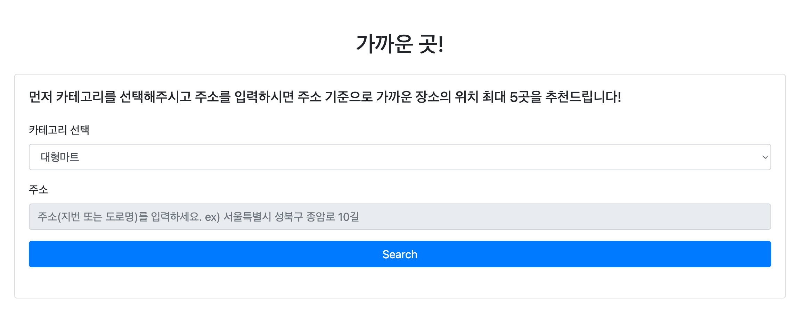
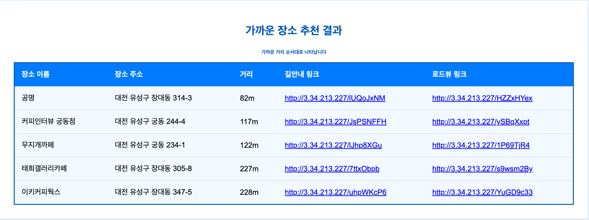
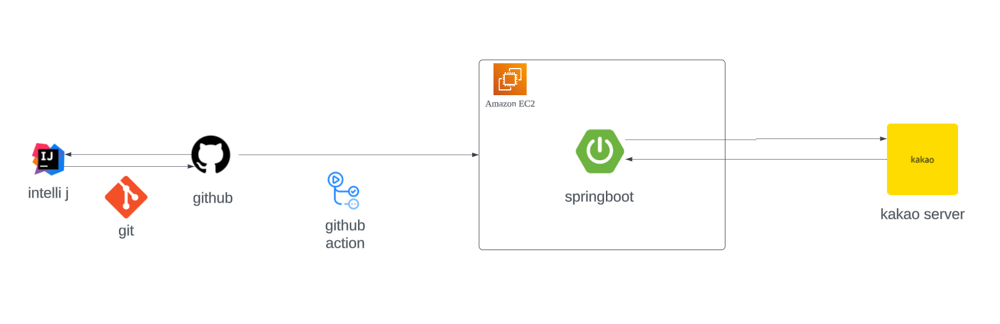
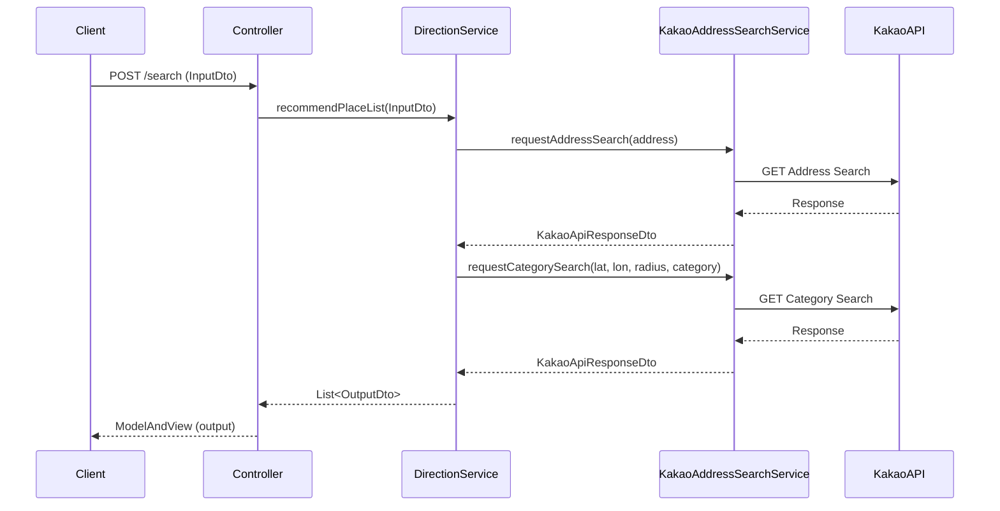
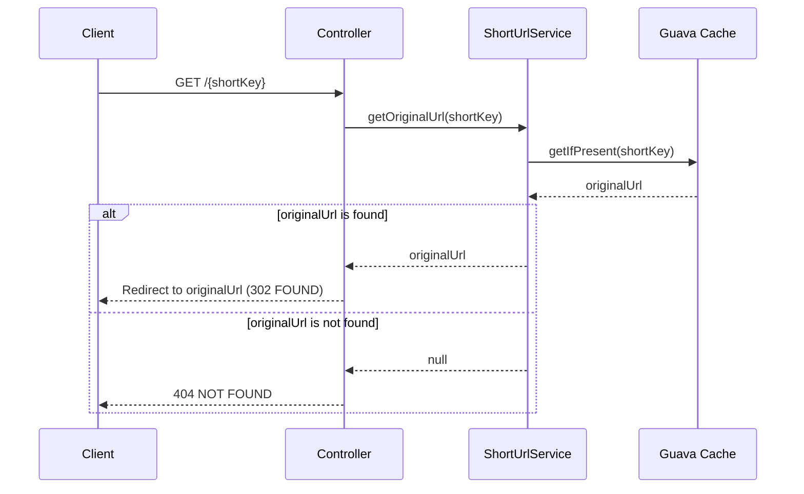

사용자가 카테고리와 주소를 입력하면 반경 10km 내 장소 5곳을 가까운 순서대로 추천해주는 서비스입니다.

카카오 api를 활용한 프로젝트로 찾을 수 있는 장소 카테고리는 아래와 같습니다.

- 대형마트, 편의점, 주차장, 주유소/충전소, 지하철역, 은행, 문화시설, 중개업소, 공공기관, 관광명소, 숙박, 음식점, 카페, 병원, 약국

# 결과물

---

[NearByPlace.ap-northeast-2.elasticbeanstalk.com](http://nearbyplace.ap-northeast-2.elasticbeanstalk.com/)

# 어플리케이션 아키텍처

---

# 기술 스택

---

### 개발 환경

- `intellij`
- `Gradle`
- `Java 17`
- `git/github`

### 기술 스택

- `spring boot`
- `thymeleaf`
- `github action`
- `kakao api`
- `AWS` - `EC2`

# 시퀀스 다이어그램

---

- 장소 추천

- 짧은 url 리다이렉팅
